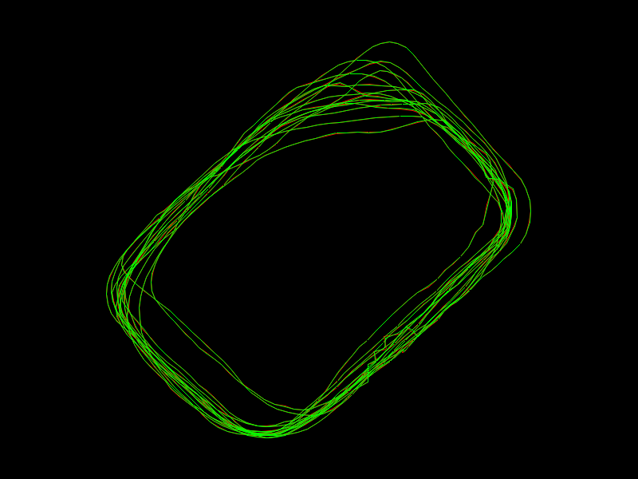
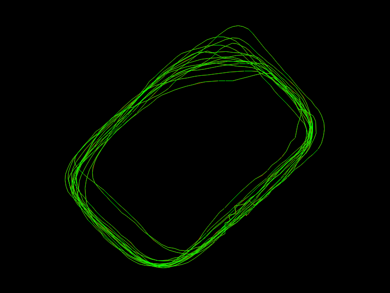
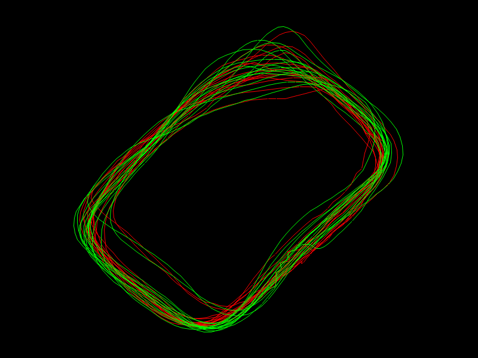
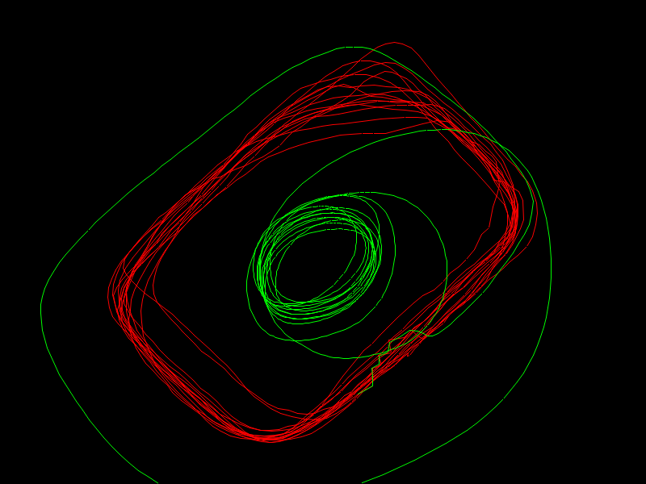
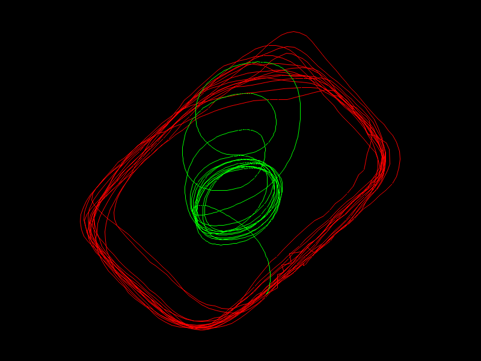

Output of `cargo run -- --help`: 

```
Visualize a GPX track and fit a curve via Kalman filter

Usage: kalman-gpx [OPTIONS]

Options:
  -i, --input-file <INPUT_FILE>
          Path to input GPX file [default: input/stadium_loops.gpx]
  -o, --output-file <OUTPUT_FILE>
          Path to output PNG file [default: plot.png]
  -m, --model-uncertainty <MODEL_UNCERTAINTY>
          How much we trust the model (x, Δx, ΔΔx, y, Δy, ΔΔy) [default: 1]
  -s, --sensor-uncertainty <SENSOR_UNCERTAINTY>
          How much we trust the sensor (GPS) [default: 1]
  -h, --help
          Print help
  -V, --version
          Print version
```

In the plots, red is raw data; green is curve fit by model.

Output of `cargo run -- -o plot1.png`; equal uncertainty:



Output of `cargo run -- -m 1e-1 -o plot2.png`; 10x more certain model:


Output of `cargo run -- -s 1e-1 -o plot3.png`; 10x more certain sensor:



Output of `cargo run -- -m 1e-1 -s 1e1 -o plot4.png`; 100x more certain model:



Output of `cargo run -- -m 1e-6 -o plot5.png`; 1'000'000x more certain model:



Output of `cargo run -- -s 1e6 -o plot6.png`; 1'000'000x more uncertain sensor:


